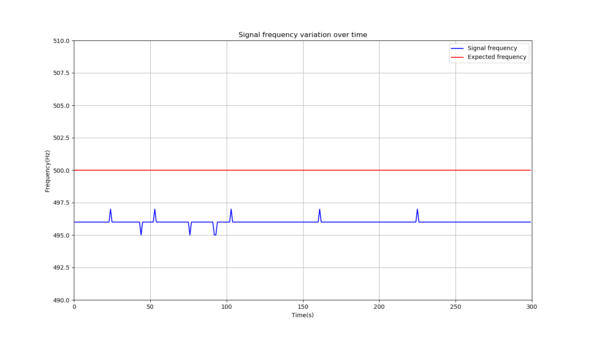
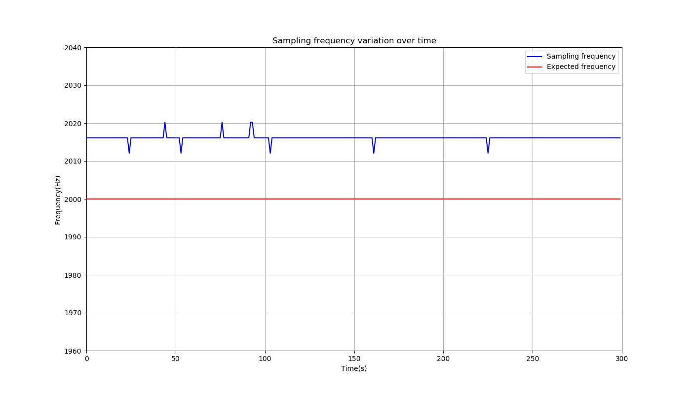

# Frequency Validation
This is the validation  for the sampling frequency. This report was generated automatically.

## Methods
A senoidal signal with a **500.000 Hz** frequency, amplitude of **1.00 V**, 
    and offset of **0.500V**  was given to the transmitter and its frequency
    was measured at the receiver.

 The supposed sampling frequency was **2000.000 Hz**, the
    signal was sampled for **300.000 seconds**, and the FFT (to calculate the 
    frequency) was calculated every **1.000 seconds**.

 In order 
    to calculate the sampling frequency, the signal frequency
    was supposed to be static  (even though it is widely known that it admits a little
    fluctuation, which is also shown in the results).

 The sampled signal was generated
    by a SIGLENT SDG 830 function generator.

## Results and discussion
### Signal frequency variation
The following table analyzes the signal frequency that was measured.

 | Unit               |  Value     |
 | ------------------ | :--------: |
 | Expected frequency | **500.000Hz** |
 | Mean frequency ± std\*    | **496.003±0.173Hz** |
 | Maximum measured frequency | **497.000Hz** |
 | Mininum measured frequency | **495.000Hz** |

\* Unbiased standard deviation. Same as Matlab's one.

It is important to notice that the maximum deviation from the 
    expected valued of ***500.000Hz*** was **1.000%** for values below it,
    **0.600%** for values above it, and **0.799%** for the mean. The following plot shows
    this variation

.

### Sampling frequency variation
The following table analyzes the sampling frequency that was measured.

 | Unit               |  Value     |
 | ------------------ | :--------: |
 | Expected frequency | **2000.000Hz** |
 | Mean frequency ± std\*    | **2016.116±0.705Hz** |
 | Maximum measured frequency | **2020.202Hz** |
 | Minimim measured frequency | **2012.072Hz** |

\* Unbiased standard deviation. Same as Matlab's one.

It is important to notice that the maximum deviation from the 
    expected valued of ***500.000Hz*** was **0.604%** for values below it,
    **1.010%** for values above it, and **0.806%** for the mean. The following plot shows
    this variation

.
