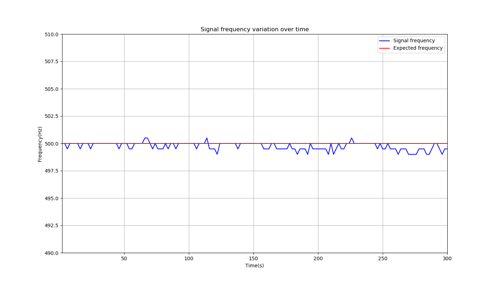
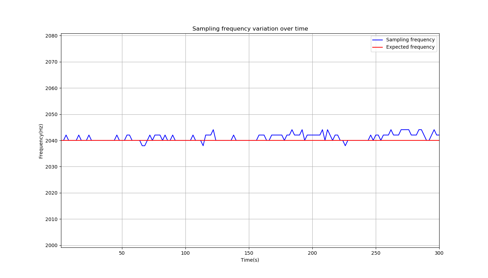

# Frequency Validation for device2
This is the validation  for the sampling frequency. This report was generated automatically.

## Methods
A senoidal signal with a **500.000 Hz** frequency, amplitude of **1.00 V**, 
    and offset of **0.500V**  was given to the transmitter and its frequency
    was measured at the receiver.

 The supposed sampling frequency was **2040.000 Hz**, the
    signal was sampled for **600.000 seconds**, and the FFT (to calculate the 
    frequency) was calculated every **2.000 seconds**.

 In order 
    to calculate the sampling frequency, the signal frequency
    was supposed to be static  (even though it is widely known that it admits a little
    fluctuation, which is also shown in the results).

 The sampled signal was generated
    by a SIGLENT SDG 830 function generator.

## Results and discussion
### Signal frequency variation
The following table analyzes the signal frequency that was measured.

 | Unit               |  Value     |
 | ------------------ | :--------: |
 | Expected frequency | **500.000Hz** |
 | Mean frequency ± std\*    | **499.743±0.346Hz** |
 | Maximum measured frequency | **500.500Hz** |
 | Mininum measured frequency | **499.000Hz** |

\* Unbiased standard deviation. Same as Matlab's one.

It is important to notice that the maximum deviation from the 
    expected valued of ***500.000Hz*** was **0.200%** for values below it,
    **0.100%** for values above it, and **0.051%** for the mean. The following plot shows
    this variation

.

### Sampling frequency variation
The following table analyzes the sampling frequency that was measured.

 | Unit               |  Value     |
 | ------------------ | :--------: |
 | Expected frequency | **2040.000Hz** |
 | Mean frequency ± std\*    | **2041.049±1.415Hz** |
 | Maximum measured frequency | **2044.088Hz** |
 | Minimim measured frequency | **2037.962Hz** |

\* Unbiased standard deviation. Same as Matlab's one.

It is important to notice that the maximum deviation from the 
    expected valued of ***500.000Hz*** was **0.100%** for values below it,
    **0.200%** for values above it, and **0.051%** for the mean. The following plot shows
    this variation

.
