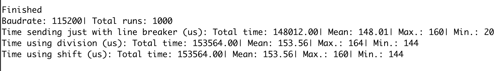

# Throughput test

This code tests the speed of serial transmission from the device to the
computer. The figure below shows  it.

Here 3 different forms of sending the data were considered:

  1)  Sending straight way (binary) with just a line breaker character ('\\n')
      in order to know where a value finishes and the next starts.

  2)  Sending data in two parts (two bytes): an upper part (VALUE/256)  and
      a  lower part (VALUE%256).

  3)  Sending data in two parts (two bytes): an upper part (VALUE>>8)  and
      a  lower part (VALUE&255).

Sending as serial in text was  not even considered  because it is much slower than
the other ways (it sends each number as a character one at a time, i.e. 'V', 'A', 'L',
'U', 'E'.)

The best way to send was sending it straight way as binary with line breaker. It is slightly
faster than the others, but has much lower minimum.

Even with the result, I'm keeping the old code, as it is faster in the python end, as
can be seen in the **conversion_time.py** code. 

